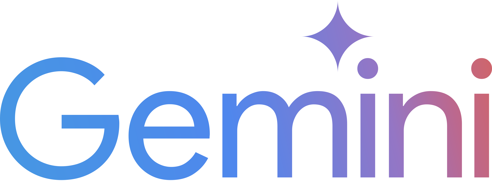

<p align="center">
  
</p>

<h1 align="center">Headless Horsemen</h1>

<p align="center">
  <strong>Give it a URL and a task. Get back a polished demo video.</strong>
  <br />
  <em>Prompt → AI navigates website → records everything → outputs a production-ready video with narration and music</em>
</p>

<p align="center">
  <a href="https://headlesshorsemen.lol">Live Demo</a> &nbsp;·&nbsp;
  <a href="#how-it-works">How It Works</a> &nbsp;·&nbsp;
  <a href="#tech-stack">Tech Stack</a> &nbsp;·&nbsp;
  <a href="#issues-we-solved">Issues We Solved</a>
</p>

<p align="center">
  <a href="https://ai.google.dev/"></a>
  &nbsp;&nbsp;&nbsp;
  <a href="https://www.browserbase.com/"></a>
  &nbsp;&nbsp;&nbsp;
  <a href="https://www.trychroma.com/"></a>
</p>

---

<h3 align="center">Director Demo</h3>
<p align="center"><em>Impersonating Connor's Browserbase Director launch demo — fully AI-generated</em></p>

<!-- PASTE the GitHub user-attachments URL here after drag-drop upload -->

> Headless Horsemen autonomously recreates a Browserbase Director product demo — navigating the site, walking through features, and generating deployable Stagehand code. Narrated end-to-end by Gemini TTS.

---

## What is this?

We built a tool that turns a single sentence into a full product demo video. You type something like *"Go to Notion and create a new page with a heading"* — and out comes a 30-second MP4 with smooth browser automation, AI-generated narration, and background music. No screen recording. No editing. No human touching a browser.

We wanted to answer one question: **can AI not just use the web, but make it look good doing it?**

Turns out, yes. But it was not easy.

## How It Works

```
 You type: { url: "https://notion.so", task: "Create a page and add a heading" }

                          │
                          ▼
               ┌─────────────────────┐
               │   1. GENERATE       │  Gemini 3.1 Pro writes a full
               │   Action Plan       │  step-by-step browser script
               └────────┬────────────┘
                         │
                         ▼
               ┌─────────────────────┐
               │   2. EXECUTE        │  Stagehand runs each step in a
               │   In Browser        │  real cloud browser (Browserbase)
               │   + Screenshot      │  capturing frames at ~15fps
               └────────┬────────────┘
                         │
                         ▼
               ┌─────────────────────┐
               │   3. NARRATE        │  Gemini 2.5 Flash TTS generates
               │   Voice-over        │  spoken narration for each step
               └────────┬────────────┘
                         │
                         ▼
               ┌─────────────────────┐
               │   4. COMPOSE        │  FFmpeg stitches frames into 60fps
               │   Final Video       │  video, burns captions, mixes audio,
               │                     │  adds fades + background music
               └─────────────────────┘

                          │
                          ▼
                     final.mp4
```

1. **Generate** — Gemini 3.1 Pro takes your URL + task description and produces a structured JSON action plan (goto, act, wait, scroll steps). One-shot, schema-constrained output. No back-and-forth.

2. **Execute** — Stagehand opens a cloud browser on Browserbase and runs each step using natural language instructions (`"click the Sign In button"`). A background thread captures JPEG screenshots at ~15fps the entire time.

3. **Narrate** — The action log gets sent to Gemini 2.5 Flash TTS, which generates spoken narration clips for each step. Voice: Puck.

4. **Compose** — FFmpeg takes the raw screenshots, interpolates them to 60fps with `minterpolate`, burns ASS-formatted captions, mixes the narration audio and optional background music, and outputs a polished H.264 MP4. Fade in. Fade out. Done.

## Tech Stack

Built entirely on sponsor technology from the [Google Gemini API Developer Competition](https://ai.google.dev/competition):

### Gemini — the brain

| Model | Role |
|-------|------|
|  **Gemini 3.1 Pro** | Script generation — turns URL + task into a structured action plan |
|  **Gemini 2.5 Flash** | Powers Stagehand's `act()` and `observe()` for real-time browser control |
|  **Gemini 2.5 Flash TTS** | Voice narration — generates spoken audio for each demo step |
| **`@google/genai` SDK** | Official Gemini TypeScript SDK (not `@google/generative-ai` — that one's deprecated) |

Three different Gemini models working together in one pipeline. Planning, acting, and speaking.

### Stagehand + Browserbase — the hands

[**Stagehand**](https://github.com/browserbase/stagehand) by Browserbase is the browser automation layer. You give it natural language instructions like `"click the Create button"` and it figures out the DOM, finds the element, and clicks it. No selectors. No XPaths. Just words.

[**Browserbase**](https://www.browserbase.com/) provides cloud browsers — real Chromium instances running on their infrastructure. No local Chrome, no headless setup, works from anywhere including Railway.

### FFmpeg — the editor

[**FFmpeg**](https://ffmpeg.org/) handles all post-production. Frame interpolation (`minterpolate` for 60fps), ASS subtitle burning, audio mixing, fade transitions. The entire video pipeline is shell commands called from TypeScript. No native bindings, no video editing libraries. Just `ffmpeg` and `ffprobe`.

### ChromaDB — the memory

[**ChromaDB Cloud**](https://www.trychroma.com/) gives the pipeline a learning loop. Every successful demo gets stored as a vector embedding — the task description, site URL, and full action plan. When a new demo request comes in, we query ChromaDB for semantically similar past demos and inject them as few-shot examples into Gemini's system prompt. The pipeline literally gets better with use.

This means if you've already demoed "browse the pricing page" on one SaaS site, the next time someone asks for a similar task on a different site, Gemini has a concrete working example to reference — not just instructions, but a proven action plan.

### The rest

| Tool | Role |
|------|------|
| **TypeScript** | Everything is TypeScript. Stagehand is TS-native, Gemini SDK is TS-native. One runtime. |
| **Express** | API server — `POST /demos` to start, `GET /demos/:id` to poll, `GET /demos/:id/video` to download |
| **Railway** | Deploy target — `nixpacks.toml` installs FFmpeg, server binds to `0.0.0.0` |

## Issues We Solved

Building this was an exercise in discovering that every layer of the stack had surprises. Here's what we ran into and how we got around it.

### Stagehand v3 killed our video recording

Stagehand v3 rewrote its internals to use CDP (Chrome DevTools Protocol) directly instead of Playwright. That means **Playwright's `recordVideo` doesn't work**. We also tried CDP's `Page.startScreencast` — doesn't work on Browserbase's cloud browsers.

**Fix:** We built our own recording system. A background loop takes `page.screenshot()` at ~15fps, saves JPEGs to disk, and FFmpeg stitches them into a video at the end. This actually turned out to be better — we have full control over frame timing, can drop frames during waits, and can do post-production effects that a raw screen recording can't.

### Stagehand's scroll is broken with Gemini 2.5 Flash

Stagehand's built-in `scrollTo` action returns an empty `elementId` when using `google/gemini-2.5-flash` on certain pages, causing a silent failure. The page just... doesn't scroll.

**Fix:** We added a custom `scroll` action type to our plan schema. Instead of going through Stagehand's scroll, we call `window.scrollBy()` directly via CDP. Gemini 3.1 Pro generates `{ action: "scroll", direction: "down", pixels: 400 }` and the executor handles it natively.

### The deprecated SDK trap

Google has two TypeScript SDKs for Gemini:
- `@google/generative-ai` — deprecated November 2025
- `@google/genai` — the current one

They have **completely different API shapes**. Different import paths, different method signatures, different config structures. The deprecated one is still the top result on most tutorials and Stack Overflow answers. We burned time on this before realizing the API calls were just silently failing.

### Structured output + thinking mode don't mix

Gemini's structured output (`responseMimeType: "application/json"` + `responseSchema`) is incredible for getting typed JSON back. But it's **not compatible with thinking mode**. Enable both and you get a 400 error with no useful message. We found this through trial and error.

### Auth walls everywhere

Our first test was "Star this GitHub repo." Gemini generated a perfect plan. Stagehand navigated to the repo. Then it clicked Star and got redirected to GitHub's login page. Every interesting demo site has an auth wall.

**Fix:** Target public-facing pages or use sites that don't require login for the demo actions. For the hackathon, we focused on public workflows — navigating docs, browsing products, filling out public forms.

### FFmpeg caption escaping nightmare

We initially tried FFmpeg's `drawtext` filter for captions. It works for one or two lines. But with 6+ captions, the filter chain becomes unreadable, and escaping colons in URLs (`https\://`) inside a shell command inside a TypeScript string is a special kind of pain.

**Fix:** Switched to ASS (Advanced SubStation Alpha) subtitle files. Generate a `.ass` file from TypeScript (it's just string concatenation), then one `ffmpeg -vf "ass=captions.ass"` command. Better styling too — semi-transparent background boxes, proper outline, consistent positioning.

### Screenshot → video looks choppy

Raw screenshots at 15fps look like a slideshow. Even at consistent intervals, the browser's rendering doesn't align with our capture timing, so you get frames that stutter.

**Fix:** FFmpeg's `minterpolate` filter. It analyzes motion between frames and generates intermediate frames to hit 60fps. The result is dramatically smoother — it looks like an actual screen recording instead of a flipbook.

## Project Structure

```
src/
  generator.ts      Gemini 3.1 → structured action plan JSON
  executor.ts       Stagehand runs plan + captures screenshots + ffmpeg
  memory.ts         ChromaDB Cloud — store & recall demo plans
  server.ts         Express API + serves the UI
  types.ts          ActionStep, DemoOptions, DemoRequest

public/
  index.html        Single-page UI (inline CSS, no build tools)
  logo.png          Headless Horsemen logo
  favicon.png       Favicon

scripts/
  test-stagehand.ts         Quick test: hardcoded actions → video
  test-pipeline.ts          E2E: URL + task → polished video
  generate-connor-demo.ts   Scripted demo with TTS narration
  seed-memory.ts            Pre-seed ChromaDB with example plans

design/
  api-design.md       API spec, endpoints, UI mockup
  ffmpeg-research.md  Caption burning, transitions, audio mixing research
  openapi.yaml        OpenAPI 3.0 spec
```

## Run It Locally

```bash
# Clone
git clone https://github.com/lorenjphillips/headless-horsemen.git
cd headless-horsemen

# Install
npm install

# Environment
cp .env.example .env
# Add your keys:
#   GEMINI_API_KEY=
#   BROWSERBASE_API_KEY=
#   BROWSERBASE_PROJECT_ID=
#   CHROMA_API_KEY=
#   CHROMA_TENANT=
#   CHROMA_DATABASE=

# Run
npm start
# → http://localhost:3000
```

Requires FFmpeg installed locally (`brew install ffmpeg` on macOS).

## Built By

<table>
  <tr>
    <td align="center">
      <a href="https://www.linkedin.com/in/lorenjphillips/">
        <strong>Loren Phillips</strong>
      </a>
    </td>
    <td align="center">
      <a href="https://www.linkedin.com/in/yonge-bai/">
        <strong>Yonge Bai</strong>
      </a>
    </td>
    <td align="center">
      <strong>Tokens</strong>
      <br />
      <em>(our AI co-founder)</em>
    </td>
  </tr>
</table>

---

<p align="center">
  Built for the <a href="https://ai.google.dev/competition">Google Gemini API Developer Competition 2026</a>
</p>
